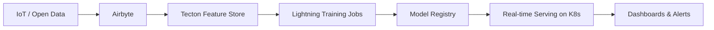
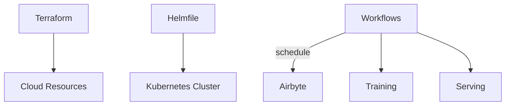

# CityScale-AI-Real-Time-CBD-Foot-Traffic-Forecasting-MLOps-Platform

## Airbyte Connections

Example source and destination configuration templates are available under `airbyte/config`.
Each file contains placeholder credentials and incremental sync settings so that only new or
updated records are transferred on each run.

### Deploy with Docker Compose

1. Replace the credential placeholders in the YAML files or provide the values as environment
   variables before deployment.
2. Start the Airbyte services using Docker Compose:

   ```bash
   docker compose up -d
   ```
3. Apply the configuration files via the Airbyte CLI or API. Example using the Airbyte CLI
   container:

   ```bash
   docker compose run --rm airbyte-cli apply --config-dir airbyte/config
   ```

The above command will register the sources and Snowflake destination defined in the YAML files.

# CityScale-AI Real-Time CBD Foot Traffic Forecasting MLOps Platform

## Overview
CityScale-AI is an end-to-end platform for forecasting pedestrian foot traffic in central business districts (CBDs). The system ingests real-time signals from edge sensors and open data feeds, builds ML features, trains forecasting models, and serves predictions to downstream applications.

Key capabilities:
- Streaming data ingestion via Airbyte
- Feature engineering with Tecton
- Model training using PyTorch Lightning
- Model serving in Kubernetes with continuous deployment
- Infrastructure automation with Terraform and Helmfile
- Automated workflows orchestrated through DAGs

## Architecture
### Data and ML Pipeline


### Infrastructure


## Directory Structure
```
airbyte/          # Airbyte connector configurations
dags/
  assets/         # Shared DAG assets
  jobs/           # Workflow definitions
features/
  tecton/         # Tecton feature definitions
models/
  lightning/      # Training code (PyTorch Lightning)
  serving/        # Deployment and inference code
k8s/              # Kubernetes manifests
infra/
  terraform/
    core/         # Core infrastructure
    data/         # Data infrastructure
  helmfile/       # Helmfile deployments
.github/
  workflows/      # CI/CD pipelines
docs/             # Project documentation
```

## Usage
1. **Provision infrastructure**
    ```bash
    cd infra/terraform/core
    terraform init && terraform apply
    ```

2. **Deploy services**
    ```bash
    cd ../../helmfile
    helmfile sync
    ```

3. **Configure Airbyte connectors**
    ```bash
    cd ../../../airbyte/config
    # edit connector config files
    ```

4. **Run feature and model pipelines**
    ```bash
    cd ../../dags/jobs
    # schedule DAGs via your orchestrator
    ```

5. **Develop models**
    ```bash
    cd ../../models/lightning
    # implement training scripts
    ```

6. **Serve predictions**
    ```bash
    cd ../serving
    # deploy serving container to Kubernetes
    ```

## Contributing
Pull requests are welcome. Please run tests before submitting.

## License
MIT
